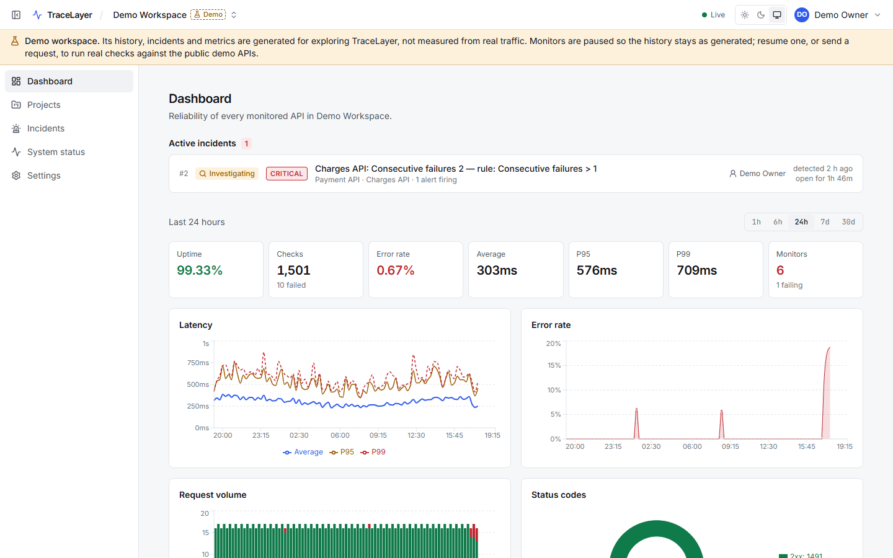
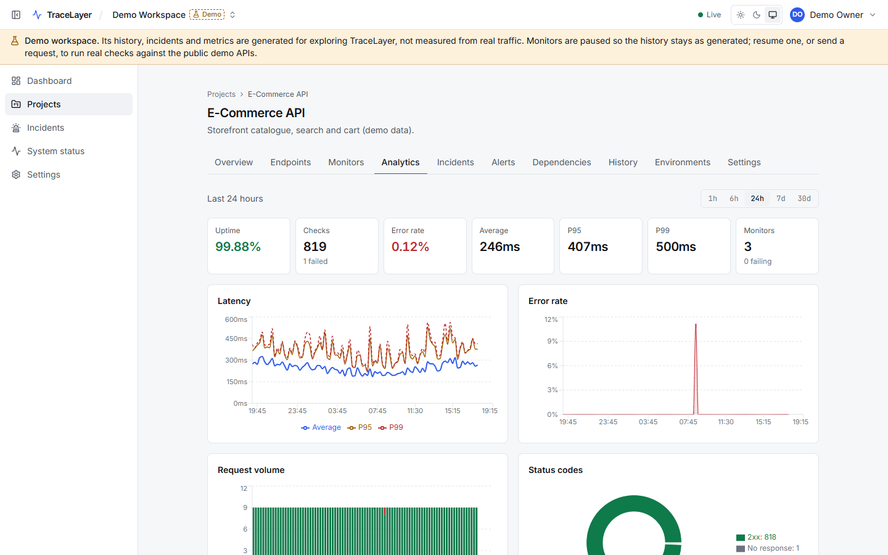
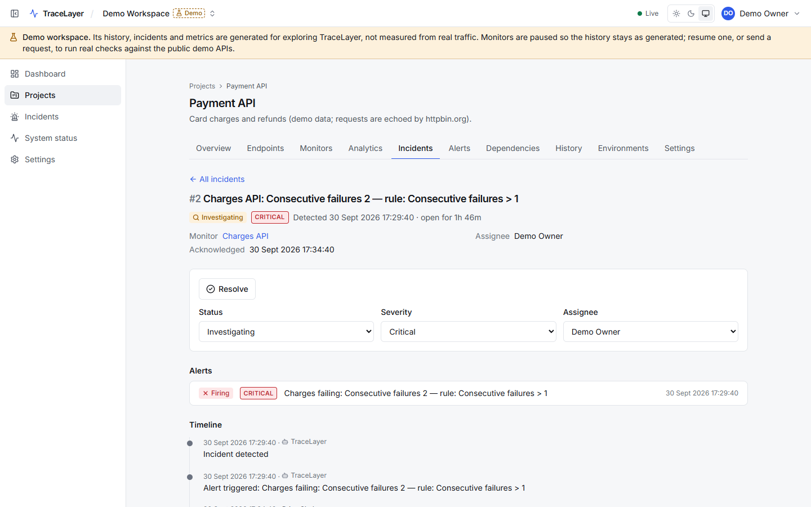
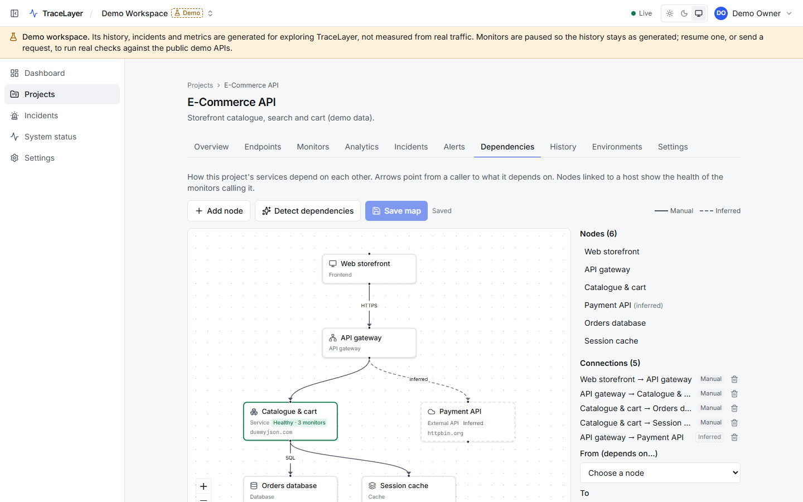
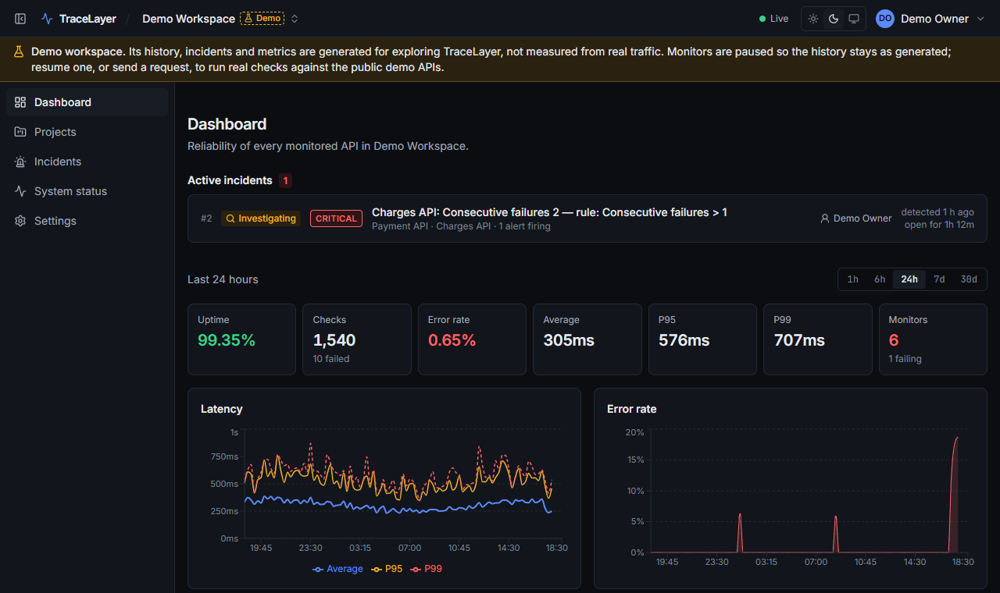

# TraceLayer

**API Reliability & Observability Platform.** TraceLayer helps developers and engineering teams
understand whether their APIs are healthy, how they are performing, when they fail, and what
caused the failure.



## Contents

- [Project overview](#project-overview)
- [Problem statement](#problem-statement)
- [Product features](#product-features)
- [Architecture](#architecture)
- [Technology stack](#technology-stack)
- [System design](#system-design)
- [Database schema](#database-schema)
- [API documentation](#api-documentation)
- [Security architecture](#security-architecture)
- [Monitoring architecture](#monitoring-architecture)
- [Docker setup](#docker-setup)
- [Local development](#local-development)
- [Testing](#testing)
- [Deployment](#deployment)
- [Screenshots](#screenshots)
- [Future improvements](#future-improvements)
- [Documentation](#documentation)

## Project overview

TraceLayer schedules recurring checks against your APIs, records every result, and turns what
it sees into answers:

- **Metrics:** uptime, error rate and latency percentiles.
- **Health:** a status for every monitor, project and dependency.
- **Alerts and incidents:** alert rules that fire and resolve on their own, and incidents the
  team works through together, with a timeline.

Everything updates live in the browser. Teams share workspaces under role-based permissions.
Credentials live in encrypted secrets. Every request the platform sends is protected against
server-side request forgery (SSRF).

It is a monorepo with three apps: a React frontend, an Express API, and a worker that runs the
checks. Behind them sit PostgreSQL and Redis. `docker compose up` starts all of it, and a single
command seeds a demo workspace with a week of realistic history.

## Problem statement

Most API tools answer "what did this one request return?". Teams running APIs in production need
different answers:

- Is the API up right now?
- Is it getting slower?
- When did it start failing, and why?

TraceLayer is built for those questions. It records every check, turns threshold breaches into
incidents with a timeline, and alerts the right people. It is a monitoring and investigation tool,
not a Postman clone.

## Product features

| Area                  | What you get                                                                                                                                                                                               |
| --------------------- | ---------------------------------------------------------------------------------------------------------------------------------------------------------------------------------------------------------- |
| Accounts and teams    | Sign-up and sign-in with rotating refresh tokens. Workspaces with four roles (owner, admin, member, viewer). Existing users are added as members by email                                                  |
| Projects              | Projects with environments (base URL, variables) and encrypted, write-only secret variables                                                                                                                |
| API endpoints         | Saved requests: method, URL, headers, query, body, auth, timeout, expected status and tags, using `{{VARIABLES}}`                                                                                          |
| Request builder       | Send any endpoint, inspect the response (status, timing, size, headers, body) and search the request history                                                                                               |
| Monitors              | Scheduled checks from every minute to every hour: availability, expected status, response time, and response validation (JSON path assertions). Run now, pause, resume                                     |
| Metrics and analytics | Uptime, error rate, average and P50/P95/P99 latency, status codes and health, from 1 hour to 30 days, for the workspace, a project, an endpoint or a monitor                                               |
| Alerts                | Rules on P95 latency, response time, error rate, uptime, status code or consecutive failures, with a duration and severity. They fire and resolve automatically and email the chosen notification channels |
| Incidents             | Opened by firing alerts. Acknowledge, investigate, assign, comment and resolve, with a full timeline. They resolve themselves when the monitor recovers                                                    |
| Real-time             | Monitor status, incidents, alerts and the dashboard update live over Socket.IO, with in-app notifications                                                                                                  |
| Dependency map        | An editable map of the project's services (React Flow), with live health, and dependencies detected from the hosts your endpoints call                                                                     |
| System status         | Live health of the API, database, Redis and worker                                                                                                                                                         |
| Demo data             | A clearly marked demo workspace: three projects, six monitors and a week of history with outages and incidents                                                                                             |
| Experience            | Light and dark themes, a responsive layout down to phone width, keyboard- and screen-reader-friendly pages (checked with axe), reduced-motion support                                                      |

## Architecture

```text
                    ┌──────────────────────────┐
  Browser  ───────▶ │  Frontend (React + Vite) │  served by nginx in Docker
                    └────────────┬─────────────┘
                                 │  /api/*  (REST)        /socket.io/*  (WebSocket)
                                 ▼
                    ┌──────────────────────────┐
                    │   Backend (Express API)  │ ── Socket.IO server (Redis adapter)
                    │  routes → controllers →  │
                    │        services          │
                    └──────┬───────────┬───────┘
                           │           │
                 Prisma    │           │  ioredis: BullMQ producers, rate limits
                           ▼           ▼
                   ┌────────────┐ ┌────────────┐
                   │ PostgreSQL │ │   Redis    │
                   └─────▲──────┘ └─────┬──────┘
                         │              │  BullMQ queues "monitor-checks", "notifications"
                         │              ▼
                         │     ┌──────────────────┐        ┌───────────────┐
                         └──── │  Worker (BullMQ) │ ─────▶ │ External APIs │  (SSRF-protected)
                               └────────┬─────────┘        └───────────────┘
                                        │  events through Redis (Socket.IO emitter)
                                        ▼
                               Socket.IO on the backend → React dashboard
```

Three flows run through it:

| Flow                                              | Purpose                                             |
| ------------------------------------------------- | --------------------------------------------------- |
| React → Express API → Service layer → PostgreSQL  | Every user-driven read and write                    |
| Express → Redis → BullMQ → Worker → External APIs | Scheduled and on-demand monitor checks, off the API |
| Worker → Socket.IO → React dashboard              | Live check results, incidents and health changes    |

**The components:**

- **React app.** The single-page UI. It talks to the API over REST and listens for live events
  over one WebSocket. In Docker, nginx serves it and proxies `/api` and `/socket.io` to the
  backend, so the browser only ever talks to one origin.
- **Express API.** Authentication, authorization, validation, and every read and write. It is
  structured as routes → controllers → services, uses structured logs with request IDs, and has
  one consistent JSON response format.
- **Service layer.** The business rules, kept separate from HTTP: permission checks, the row
  locks that prevent race conditions, and database access through Prisma.
- **PostgreSQL.** Everything durable: accounts, configuration, every monitor run, alerts and
  incidents. Metrics are computed from the runs in SQL.
- **Redis + BullMQ.** The job queues and schedules between the API and the worker, rate-limit
  counters, the worker heartbeat, and the channel that live events travel on.
- **Worker.** A separate process, so slow external APIs never block the API. It runs the checks,
  stores the results, evaluates alert rules, opens and resolves incidents, sends emails, and
  publishes live events.
- **Socket.IO.** Delivers those events to every browser subscribed to the workspace, whichever
  API instance it is connected to.

More detail, including the repository layout and each app's internals:
[docs/architecture.md](docs/architecture.md).

## Technology stack

| Area     | Technology                                                                                                                                 |
| -------- | ------------------------------------------------------------------------------------------------------------------------------------------ |
| Frontend | React 19, TypeScript, Vite 6, Tailwind CSS 4, React Router 7, Zustand, axios, React Hook Form, Zod, Recharts, React Flow, Socket.IO client |
| Backend  | Node.js 20+, Express 5, TypeScript, Zod, pino, Socket.IO (Redis adapter), jsonwebtoken, bcryptjs, Helmet, express-rate-limit               |
| Worker   | Node.js 20+, BullMQ 5, ioredis, nodemailer, Socket.IO Redis emitter                                                                        |
| Database | PostgreSQL 16, Prisma 6                                                                                                                    |
| Queue    | Redis 7, BullMQ                                                                                                                            |
| Testing  | Jest + Supertest (packages, backend, worker), Vitest + Testing Library (frontend), Playwright + axe-core (end-to-end and accessibility)    |
| Tooling  | pnpm workspaces, ESLint 9, Prettier 3, Docker Compose, GitHub Actions, Dependabot                                                          |

## System design

A few decisions shape how TraceLayer behaves under load and failure:

- **Checks never run in the API.** Monitors are BullMQ job schedulers in Redis, and the worker
  runs them with bounded concurrency. A slow or hanging external API ties up a worker slot, never
  an HTTP request. Add worker containers to run more checks.
- **The API scales horizontally.** Rate limits, Socket.IO rooms (Redis adapter) and job queues
  all live in Redis, so any number of API instances can run behind a load balancer.
- **Metrics come from raw runs.** Every check is one row in `monitor_runs`. Uptime, error rate
  and percentiles are computed in SQL over the chosen window, so the numbers are always
  consistent with the history. Runs are kept for 30 days.
- **Alerts are state machines.** Each rule is `OK`, `PENDING` or `FIRING`. It is re-evaluated
  after every check, inside a row lock, so concurrent checks cannot fire an alert twice.
- **Incidents follow alerts.** A firing alert opens an incident, or joins the monitor's open one.
  When every alert recovers, the incident resolves itself, and the timeline records who did what.
- **Live updates are a fan-out, not a source of truth.** The worker publishes events through
  Redis. Browsers apply them to what they already show, and re-fetch after a reconnect.
- **Failure is visible.** `/api/health` reports the database, Redis and the worker's heartbeat.
  The System status page and the Docker health checks use it.

## Database schema

PostgreSQL holds 20 tables in eight areas:

- **Accounts:** users, refresh tokens.
- **Workspaces:** workspaces, members.
- **Projects:** projects, environments, variables.
- **Requests:** endpoints, request history.
- **Monitoring:** monitors, runs.
- **Alerting:** rules, alerts, notification channels, notifications.
- **Incidents:** incidents and their timeline events.
- **Dependency map:** nodes and edges.

Key rules are enforced by the database itself: a secret can never be stored in plaintext, an
incident is resolved exactly when it has a resolution time, and incident numbers never repeat.

The entity-relationship diagram, every table, the constraints, indexes, row locking and
migrations are described in [docs/database.md](docs/database.md).

## API documentation

All endpoints live under `/api` and return one of two shapes:

```json
{ "success": true, "data": {} }
{ "success": false, "error": { "code": "NOT_FOUND", "message": "…", "requestId": "…" } }
```

| Resource              | Paths                                                        |
| --------------------- | ------------------------------------------------------------ |
| Health                | `GET /api/health/live`, `GET /api/health`                    |
| Authentication        | `/api/auth/register`, `login`, `refresh`, `logout`, `me`     |
| Workspaces            | `/api/workspaces/…`, including members                       |
| Projects              | `/api/projects/…`, including environments and variables      |
| Endpoints             | `/api/endpoints/…`                                           |
| Requests              | `POST /api/requests/execute`, `GET /api/requests/history`    |
| Monitors              | `/api/monitors/…`, including run now and run history         |
| Metrics               | `/api/metrics`, `/summary`, `/latency`, `/errors`            |
| Alerts                | `/api/alerts/…`: rules and fired alerts                      |
| Notification channels | `/api/notification-channels/…`, including test sends         |
| Incidents             | `/api/incidents/…`: status, severity, assignee, comments     |
| Dependencies          | `/api/dependencies`, `/suggestions`                          |
| Real-time             | Socket.IO at `/socket.io`: subscribe to a workspace's events |

Every route with its parameters, permissions, request and response bodies, and the Socket.IO
events: [docs/api.md](docs/api.md).

## Security architecture

TraceLayer sends HTTP requests to URLs its users choose, so SSRF protection is the central
concern. The rest is standard practice, applied carefully:

- **Accounts.** Passwords are hashed with bcrypt, and sign-in takes the same time whether or not
  the email exists. Access tokens are short-lived and held in memory only. Refresh tokens rotate
  and live in an `httpOnly`, `SameSite=Strict` cookie; reusing an old one revokes the session.
- **Authorization.** One permission table, enforced by the API on every request. Non-members get
  404, not 403, so workspace ids cannot be probed.
- **Secrets.** Encrypted at rest with AES-256-GCM and write-only: no endpoint ever returns them.
  Credentials in endpoint configuration must reference a secret. Secrets are only sent to their
  own environment's origin, and are masked in everything returned.
- **SSRF.** Private, loopback, link-local, cloud-metadata and internal addresses are blocked. The
  check runs on the address actually connected to, so DNS rebinding cannot bypass it, and again on
  every redirect.
- **Hardening.** Rate limits shared through Redis, Helmet headers and a strict
  Content-Security-Policy, a CORS allowlist, and body-size limits and timeouts. In production the
  services refuse to start with development secrets. Logs are deep-redacted, and containers run
  as non-root.

Details and the tests behind each item: [docs/security.md](docs/security.md).

## Monitoring architecture

```text
monitor ──schedule──▶ check (worker) ──▶ monitor_runs ──▶ metrics & health (SQL)
                                     └──▶ alert rules ──▶ alerts ──▶ incidents ──▶ notifications
                                     └──▶ real-time events ──▶ dashboard
```

1. A **monitor** is a schedule for one endpoint in one environment, with a type:
   - availability;
   - expected status;
   - response time;
   - response validation.
2. The **worker** runs each check through the SSRF-protected executor and stores the result as a
   run: success, status, duration, size, and why it failed.
3. **Metrics and health** are computed from those runs on demand. A monitor is _healthy_,
   _degraded_ or _failing_, based on its last 10 runs: three failures in a row, or half of them
   failed, is failing; any other failure is degraded.
4. **Alert rules** are evaluated after every check. A breach that lasts the rule's duration
   fires an alert and emails the rule's channels. Recovery resolves it.
5. A firing alert opens an **incident**, which resolves automatically when all its alerts
   recover.
6. Every step publishes a **live event**, so dashboards, monitor pages and incident timelines
   update without refreshing.

Scheduling, check types, health rules, alert evaluation and the incident lifecycle:
[docs/monitoring.md](docs/monitoring.md).

## Docker setup

The whole platform runs with Docker Compose:

```bash
cp .env.example .env        # development defaults work as-is
docker compose up --build
```

| Service  | URL / port                                   | Role                                                 |
| -------- | -------------------------------------------- | ---------------------------------------------------- |
| frontend | http://localhost:8080                        | nginx: the web app, proxying `/api` and `/socket.io` |
| backend  | http://localhost:4000/api/health             | Express API; applies migrations on start             |
| worker   | —                                            | Monitor checks and notifications                     |
| postgres | `localhost:5434` (user/pass/db `tracelayer`) | PostgreSQL 16                                        |
| redis    | `localhost:6379`                             | Redis 7 (AOF persistence)                            |
| mailpit  | http://localhost:8025                        | Catches alert emails in development                  |

- **Startup order.** Every service has a health check, and services start in dependency order:
  the worker waits for a healthy backend, which waits for PostgreSQL and Redis.
- **Images.** One multi-stage `Dockerfile` builds all three images. The backend and worker run
  as an unprivileged user, and the frontend is static files in nginx.
- **Stopping.** `docker compose down` stops the stack; add `-v` to also delete the database and
  Redis volumes.

### Demo data

A fresh install is empty. To explore TraceLayer with a week of history, seed the demo workspace:

```bash
docker compose exec backend node apps/backend/dist/scripts/seed-demo.js   # Docker stack
pnpm seed:demo                                                            # apps on your machine
```

- **Without options**, it creates the account `demo@demo.tracelayer.local` and prints a random
  password. The password changes on every run, so there is never a known, shared demo password.
- **With `--owner you@example.com`**, it adds the demo workspace to your own existing account.
- **Running it again** replaces the demo workspace, so its history always ends "now".

The **Demo Workspace** it creates contains:

- **Projects:** E-Commerce API, Payment API and Authentication API, with environments, encrypted
  secret variables and 9 endpoints pointing at real public demo APIs (dummyjson.com, httpbin.org).
- **Monitors:** 6, each with an alert rule, and a week of checks (about 11,000 runs). The history
  has a daily latency pattern, a catalogue outage, a search slowdown, and outages of payments and
  sign-in.
- **Incidents:** the 5 those caused, with full timelines; one is still being investigated.
- **Also:** request history, a dependency map, two demo teammates, and a disabled notification
  channel.

The history is consistent, not random:

- Every generated check is judged by the same code as real checks.
- Every alert rule is replayed over those checks exactly as the worker would.
- So each alert and incident is one the platform would really have produced.

The workspace carries a **Demo** badge, and every page in it says its data is generated. Its
monitors start paused, so the history stays as generated; resume one to check the public API for
real.

## Local development

### Prerequisites

- Node.js 20.17 or newer (see `.nvmrc`)
- pnpm 10 (`corepack enable` installs the version pinned in `package.json`)
- Docker Desktop (runs PostgreSQL and Redis; optionally the whole stack)

### Apps on your machine, databases in Docker

Faster feedback while coding: hot reload for all three apps, and nothing is rebuilt into images.

```bash
pnpm install
cp .env.example .env
pnpm infra:up      # start only PostgreSQL and Redis in Docker
pnpm db:generate   # generate the Prisma client
pnpm db:migrate    # apply migrations to the dev database
pnpm dev           # frontend, backend and worker with hot reload
```

- **Where it runs.** The app is at http://localhost:5180; Vite proxies `/api` to the backend on
  port 4000. Create an account to get started, since every page except sign-in and sign-up needs
  one.
- **Port 4000.** If the Docker `backend` container is also running, stop it first
  (`docker compose stop backend worker frontend`).
- **PostgreSQL port.** It is published on port **5434**, so it does not clash with a local
  PostgreSQL. To change it, set `POSTGRES_PORT` and `DATABASE_URL` in `.env`.

### Useful scripts

| Command                        | What it does                               |
| ------------------------------ | ------------------------------------------ |
| `pnpm dev`                     | Run all apps in watch mode                 |
| `pnpm build`                   | Build every package and app                |
| `pnpm typecheck`               | Type-check the whole workspace             |
| `pnpm lint`                    | ESLint                                     |
| `pnpm format:check`            | Prettier check (`pnpm format` to fix)      |
| `pnpm test`                    | Run all test suites                        |
| `pnpm test:e2e`                | End-to-end tests against the Docker stack  |
| `pnpm infra:up` / `infra:down` | Start / stop PostgreSQL and Redis          |
| `pnpm db:migrate`              | Create and apply a migration (development) |
| `pnpm seed:demo`               | Seed the demo workspace                    |

## Testing

```bash
pnpm infra:up                  # PostgreSQL and Redis for the integration tests
pnpm typecheck && pnpm lint && pnpm format:check && pnpm test

docker compose up -d --build   # the full stack, for the end-to-end tests
pnpm test:e2e
```

| Level         | Tool                     | Covers                                                                                                                                         |
| ------------- | ------------------------ | ---------------------------------------------------------------------------------------------------------------------------------------------- |
| Unit          | Jest                     | Validation, check evaluation, health rules, SSRF rules, request execution, timeline text                                                       |
| Integration   | Jest + Supertest         | Every API route against real PostgreSQL and Redis; the worker's checks, alerts, incidents, notifications and schedules; forced race conditions |
| Frontend      | Vitest + Testing Library | Login, dashboard, endpoint and monitor creation, incident filtering, charts, empty states, live updates                                        |
| End-to-end    | Playwright               | The critical flow in a real browser against the Docker stack: register → … → resolve incident                                                  |
| Accessibility | Playwright + axe-core    | The main pages in light and dark themes, against WCAG 2.1 AA                                                                                   |

- **Separate databases.** Integration tests use their own test databases, so development data is
  never touched.
- **No browser download on Windows.** The end-to-end tests drive the Microsoft Edge that ships
  with Windows.
- **CI.** Every push and pull request runs all of this in GitHub Actions: lint, formatting, type
  check, unit, integration and frontend tests, the builds, then the end-to-end tests against the
  Docker stack. Dependabot keeps dependencies current.

Details, settings and what each suite covers: [docs/testing.md](docs/testing.md).

## Deployment

TraceLayer runs anywhere Docker Compose does; each part can also move to a managed service.

For production:

- set real JWT secrets and a new `ENCRYPTION_KEY`, and back up the key;
- set `PUBLIC_URL` to the public origin;
- serve it over HTTPS behind a reverse proxy that adds HSTS;
- keep PostgreSQL, Redis and the API off the internet.

The services refuse to start in production while a development secret is still in use.

The full guide covers settings, the steps, backups, scaling and a production checklist:
[docs/deployment.md](docs/deployment.md).

## Screenshots

**Dashboard.** Every monitored API in the workspace: active incidents, uptime, error rate,
latency percentiles and traffic.


**Analytics.** Latency, error-rate, volume and status-code charts for a project, over 1 hour to
30 days.



**Incident.** Status, severity and assignee, the alerts behind it, and the timeline of what
happened and who did what.



**Dependency map.** A project's services and what they call, with the live health of the
monitors behind each node. Dashed edges are inferred from the hosts the endpoints call.



**Dark theme.**



## Future improvements

- **More notification channels:** Slack, Microsoft Teams, PagerDuty and generic webhooks, next to
  email.
- **Public status pages** per workspace, fed by the same monitors and incidents.
- **Multi-region checks:** run each monitor from several locations to tell a regional outage
  from a global one.
- **Distributed tracing:** accept OpenTelemetry traces, to follow a slow request through the
  services on the dependency map.
- **Long-term metrics:** roll old runs up into hourly aggregates, so history can outlive the
  30-day retention.
- **Workspace invitations by link** for people without an account yet, and single sign-on
  (SAML/OIDC) for larger teams.
- **API keys and a CLI** to manage monitors as code, for example from a CI pipeline.
- **Maintenance windows** that pause alerts during planned downtime.

## Documentation

| Document                                     | Contents                                                                              |
| -------------------------------------------- | ------------------------------------------------------------------------------------- |
| [docs/architecture.md](docs/architecture.md) | System design, repository layout, components, configuration                           |
| [docs/monitoring.md](docs/monitoring.md)     | Monitors, metrics and health, analytics, alerts, incidents, real-time, dependency map |
| [docs/security.md](docs/security.md)         | Authentication, authorization, SSRF protection, hardening                             |
| [docs/database.md](docs/database.md)         | Schema, relationships, constraints, indexes, locking, migrations                      |
| [docs/api.md](docs/api.md)                   | Every REST route and the Socket.IO events                                             |
| [docs/testing.md](docs/testing.md)           | Test strategy, suites, end-to-end tests and CI                                        |
| [docs/deployment.md](docs/deployment.md)     | Running TraceLayer in production                                                      |
| [docs/SPEC.md](docs/SPEC.md)                 | The master product and engineering specification                                      |
