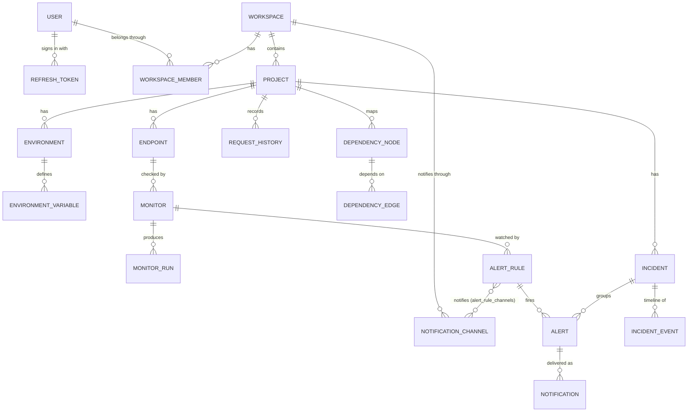

# Database

PostgreSQL 16 is the system of record, accessed through Prisma 6. The schema lives in
[`packages/db/prisma/schema.prisma`](../packages/db/prisma/schema.prisma); its history is the
migrations next to it.

## Conventions

- **Ids** are UUIDs. Tables and columns are `snake_case` in the database (`@@map` / `@map`) and
  `camelCase` in code.
- **Times** are `timestamptz(3)`, stored in UTC with millisecond precision.
- **Names are unique where people pick them**, per parent: a project name within a workspace,
  an endpoint or monitor name within a project, a variable key within an environment. The
  service compares names case-insensitively; a unique index is the backstop.
- **Delete rules follow ownership.** Children of a parent are deleted with it (`Cascade`).
  References that record history are cleared instead (`SetNull`), so history survives. For
  example, an incident keeps its timeline when its monitor, rule or assignee is deleted.

## Entity relationships



## Tables

| Area           | Table                   | Holds                                                                                                            |
| -------------- | ----------------------- | ---------------------------------------------------------------------------------------------------------------- |
| Accounts       | `users`                 | Name, lowercased email (unique), bcrypt password hash                                                            |
|                | `refresh_tokens`        | HMAC of each refresh token, its login family, expiry and revocation (see [security](security.md#authentication)) |
| Workspaces     | `workspaces`            | Name, and `is_demo` for the generated demo workspace                                                             |
|                | `workspace_members`     | User, workspace and role (`OWNER`, `ADMIN`, `MEMBER`, `VIEWER`)                                                  |
| Projects       | `projects`              | Name, description, the incident counter and the dependency-map version                                           |
|                | `environments`          | Name, base URL, display position                                                                                 |
|                | `environment_variables` | Plain `value`, or `encrypted_value` for secrets (never both)                                                     |
| Requests       | `endpoints`             | Method, URL, headers, query, body and auth (JSON), timeout, expected status, tags                                |
|                | `request_history`       | Every request sent from the request builder, with secrets masked                                                 |
| Monitoring     | `monitors`              | Type, interval, timeout, thresholds, assertions (JSON), cached last result and failure streak                    |
|                | `monitor_runs`          | One row per check: time, success, status, duration, size, timeout, failure reason                                |
| Alerting       | `alert_rules`           | Metric, threshold, duration, severity, and the evaluated state (`OK`, `PENDING`, `FIRING`)                       |
|                | `alerts`                | One firing of a rule, from breach to recovery                                                                    |
|                | `notification_channels` | Email recipients (JSON), enabled flag                                                                            |
|                | `alert_rule_channels`   | Which channels a rule notifies                                                                                   |
|                | `notifications`         | Delivery log per channel: event, status, attempts, last error                                                    |
| Incidents      | `incidents`             | Per-project number, title, severity, status, assignee, detected/acknowledged/resolved times                      |
|                | `incident_events`       | The timeline: type, actor (null for TraceLayer), message, before/after values                                    |
| Dependency map | `dependency_nodes`      | Label, kind, origin (`MANUAL`/`INFERRED`), host, position                                                        |
|                | `dependency_edges`      | Source → target, origin, label                                                                                   |

## Integrity rules in the database

Some rules are too important to trust to application code alone:

| Constraint                                            | Rule                                                                                                          |
| ----------------------------------------------------- | ------------------------------------------------------------------------------------------------------------- |
| `environment_variables_value_matches_secret_flag`     | A secret has only `encrypted_value`; a plain variable only `value`. A secret can never be stored in plaintext |
| `incidents_resolved_at_check`                         | An incident is `RESOLVED` exactly when `resolved_at` is set                                                   |
| `dependency_edges_no_self_loop`                       | A node cannot depend on itself                                                                                |
| Unique `(project_id, number)` on `incidents`          | Incident numbers never repeat within a project                                                                |
| Unique `(source_id, target_id)` on `dependency_edges` | Two nodes are connected at most once                                                                          |
| Unique `token_hash` on `refresh_tokens`               | Each refresh token is recorded once                                                                           |

## Indexes

Chosen for the queries the app actually runs (spec §34):

- **Time series:** `monitor_runs (monitor_id, started_at DESC)` and `(project_id, started_at DESC)`
  serve metrics per monitor and per project; `started_at` alone serves retention.
- **Lists, newest first:** `request_history (project_id, created_at DESC)`, `alerts (project_id,
fired_at DESC)`, `incidents (project_id, detected_at DESC)`, `notifications (channel_id,
created_at DESC)`.
- **Filters:** `incidents (project_id, status)`, `(monitor_id, status)` and `(assignee_id)`;
  `alerts (rule_id, status)`; `monitors (enabled)` for the scheduler.
- **Every foreign key** used to list children (`project_id`, `workspace_id`, `endpoint_id`, …).

## Concurrency

"Check, then write" sequences run in a transaction that first locks the parent row
(`SELECT … FOR UPDATE`), so two requests cannot both pass the check. Examples:

| Lock                      | Protects                                                                                  |
| ------------------------- | ----------------------------------------------------------------------------------------- |
| The workspace's members   | "A workspace always keeps an owner" when owners demote or remove each other               |
| The project               | Per-project limits and case-insensitive name uniqueness; the dependency-map version check |
| The monitor's alert rules | Two checks of one monitor firing the same alert or opening two incidents                  |
| The incident              | A person's change and the worker's automatic resolution never interleave                  |

Incident numbers come from `UPDATE projects SET incident_counter = incident_counter + 1 …
RETURNING`, which is atomic on its own. Every one of these races has a test that forces the
overlap and fails without the lock (see [testing](testing.md)).

## Retention

- **Monitor runs:** kept 30 days. The worker's daily maintenance job deletes older ones.
- **Request history:** the newest 5,000 entries per project.
- Everything else is kept until its owner deletes it.

## Migrations

```bash
pnpm db:migrate     # development: create and apply a migration from schema changes
pnpm db:deploy      # apply pending migrations (what production does)
pnpm db:generate    # regenerate the Prisma client after pulling schema changes
```

- In Docker, the backend container runs `prisma migrate deploy` before it starts, so the schema
  is always current. The worker waits for the backend to be healthy.
- Migrations are plain SQL files, committed. Rules Prisma cannot express, such as the CHECK
  constraints above, are added to the generated SQL by hand.
- Tests migrate their own databases (`tracelayer_test`, `tracelayer_worker_test`) and refuse to
  run against a database whose name does not end in `_test`.
